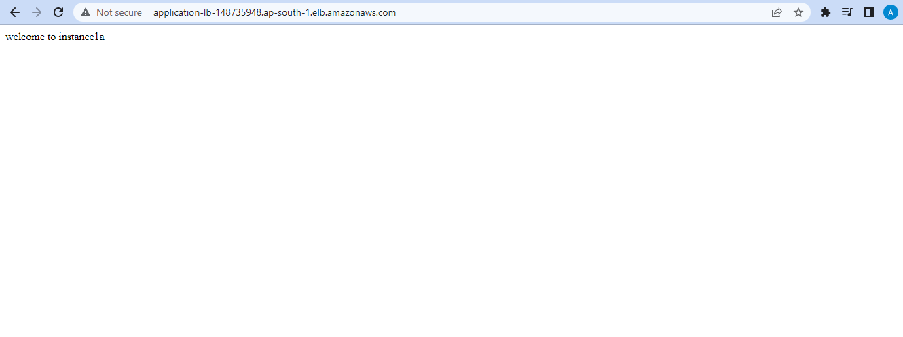

# AWS

**LOAD BALANCER** The growth in the number of active users inevitably leads to an increase in the load on the servers. To ensure good UX it is necessary to properly balance the load. This is why the use of load balancer is important – it distributes network or application traffic between multiple servers in a server pool. Each load balancer resides between client devices and back-end servers, receiving and distributing incoming requests to any available server capable of fulfilling them.

 ## Load Balancer Types
- [Classic load balancer](#classic)
- [Application load balancer](#application)
- [Network load balancer](#network)
- [Gateway load balancer](#gateway)

## 1. Classic load balancer 

***Create a Classic Load Balancer***
- Create atleast 3-4 instances with bootstrap script in the the 3 different availability zones.
.png>)

- Check whether all the instances are running by copying their public IP-address on the browser. 

Instance1
.png>)
Instance2
.png>)
Instance3
.png>)

- Create **Classic Load Balancer** and add all the 3 target instances.
.png>)

- Select the classic load balancer, go to details and copy the DNS name for example-http://classiclb-1652469063.ap-south-1.elb.amazonaws.com/.

- Paste the DNS name on the browser, reload the page again and again to check whether load balancer is working or not.

- Remove the access of instances that are directly accessed from their IP addresses. By removing the HTTP security group from each instances.
 .png>)
Now, again copy the ip address of instances are running or not. If they are not respnse back it means you are on a right path and the target-instances of load balancer will show Out of Service.
.png>)

- Now, again edit all the instances security group
and add the Type-HTTP & source-add the security group of load balancer which shows in the below ss.
.png>)
Here we can see that the one instance which is attached to load balancer security group comes In-service.
.png>)
Do the same with all the remaining servers.

- After doing the above task, now if we check the load balancer target instances it will show In-service.
.png>)
after this the load balancer will again start working but we can't access the instances by their public ip addresses.

## 2. Application load balancer 

***Create a Application Load Balancer***

- Create atleast 3-4 instances with bootstrap script in the the 3 different availability zones.
.png>)

- Create **Target Group** of the running instances.
.png>)
Below (blue-application) named target group has been created.
.png>)

- Create **Application Load Balancer**, give name to load balancer, select all avalability zones, create a security group, add a target group, create load balancer.
.png>)

- Copy the DNS name and Paste it on the browser, reload the page again and again to check whether load balancer is working or not. 

- Hence, follow the same steps of CLB to remove access of instances through HTTP port.

[***Path Base Routing in Application Load Balancer***](https://www.youtube.com/watch?v=rk-WLPjV09U&list=PL6XT0grm_TfgtwtwUit305qS-HhDvb4du&index=43&ab_channel=GauravSharma)

## 3. Network load balancer 

- It works on the Transport Layer.
- Its works is to send the request from the IP address to the specific port number.
- This LB doesn't have much details as ALB.so,it's fast.

***Create a Network Load Balancer***
- Create atleast 3-4 instances with bootstrap script in the the 3 different availability zones.
.png>)

- Create **Target Group** of the running instances.
.png>)
Below (Network-lb-tg) named target group has been created.
.png>)

 - Create **Network Load Balancer**, give name to load balancer, select all avalability zones, create a security group, add a target group, create load balancer.
.png>)

- Copy the DNS name and Paste it on the browser, reload the page again and again to check whether load balancer is working or not.
